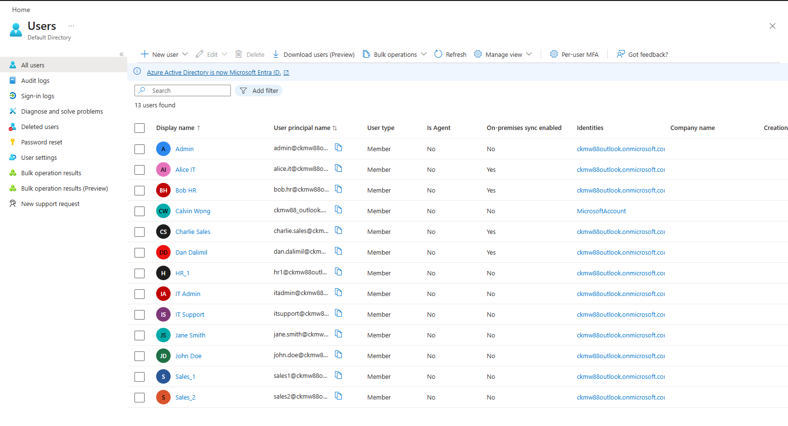
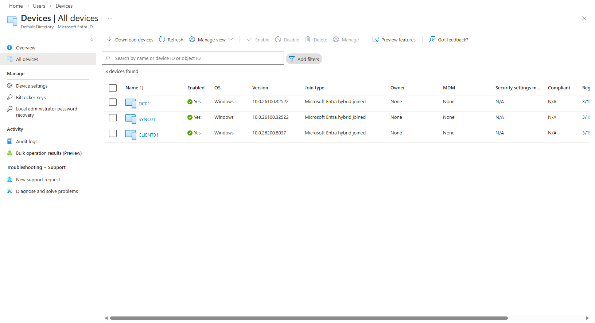

# Hybrid Identity Lab (Active Directory + Microsoft Entra ID)

## 🚀 Overview
This project demonstrates a **hybrid identity environment** integrating on-premises **Active Directory** with **Microsoft Entra ID (Azure AD)** using Microsoft Entra Connect.

It simulates a real enterprise setup where identities are managed on-premises and synchronized securely to the cloud.

---

## 🏗️ Architecture

## Architecture Diagram


---

## 🖥️ Environment

- **DC01** – Active Directory Domain Controller
- **SYNC01** – Microsoft Entra Connect Sync Server
- **CLIENT01** – Windows 11 domain-joined workstation
- **Microsoft Entra ID** – Cloud identity platform

---

## ⚙️ Features Implemented

- Active Directory Domain Services (AD DS)
- Organizational Units and security groups
- Department-based file shares and NTFS permissions
- Group Policy drive mapping
- Microsoft Entra Connect (directory synchronization)
- Hybrid Microsoft Entra joined device
- Security Defaults (baseline MFA)

---

## ☁️ Hybrid Identity Flow

```text
User logs in → CLIENT01 → DC01 (authentication)

DC01 → SYNC01 → Microsoft Entra ID (sync users + passwords)

CLIENT01 → Microsoft Entra ID (device registration)
```

---

## 📄 Documentation

- [Setup Guide](./SETUP-GUIDE.md)
- [Architecture](./ARCHITECTURE.md)

---

## 🧠 Skills Demonstrated

- Active Directory Administration
- Identity & Access Management (IAM)
- Hybrid Identity (On-Prem + Cloud)
- Microsoft Entra Connect
- Group Policy (GPO)
- NTFS Permissions
- Azure Identity Management
- Device Identity (Hybrid Join)

---

## 📸 Screenshots

> (Add your screenshots here after uploading to the IMAGES folder)

```markdown


```

---

## 💼 Resume-Ready Description

> Built a hybrid identity lab integrating on-premises Active Directory with Microsoft Entra ID using Entra Connect. Configured hybrid joined devices, synchronized users and groups, and implemented baseline identity security using Security Defaults.

---

## 🚀 Future Improvements

- Conditional Access policies (requires P1 license)
- Self-Service Password Reset (SSPR)
- Microsoft Intune device management
- Monitoring and logging (Entra sign-in logs)

---

## 👤 Author

Calvin Wong

