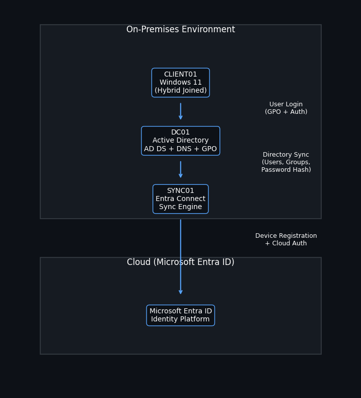
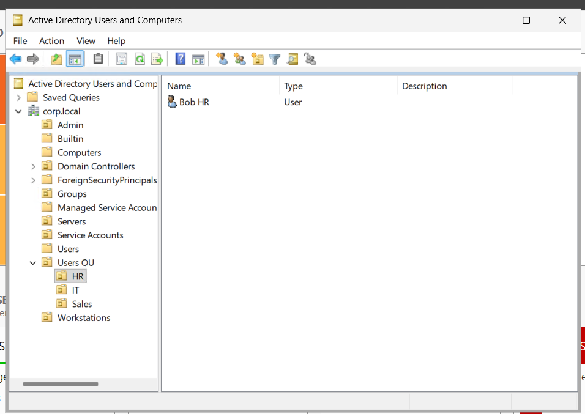
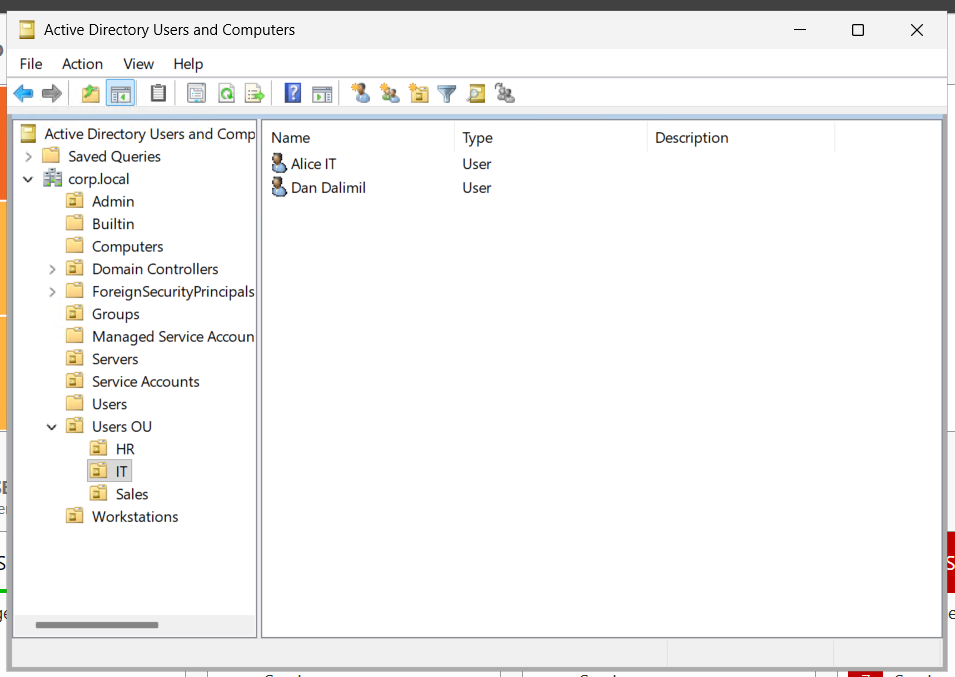
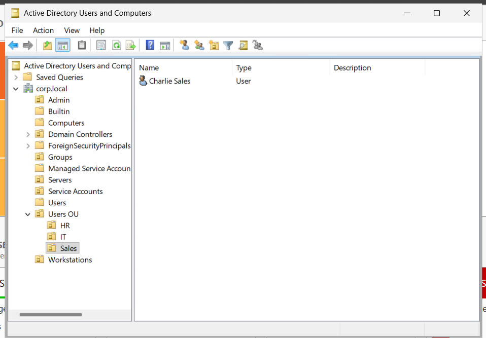
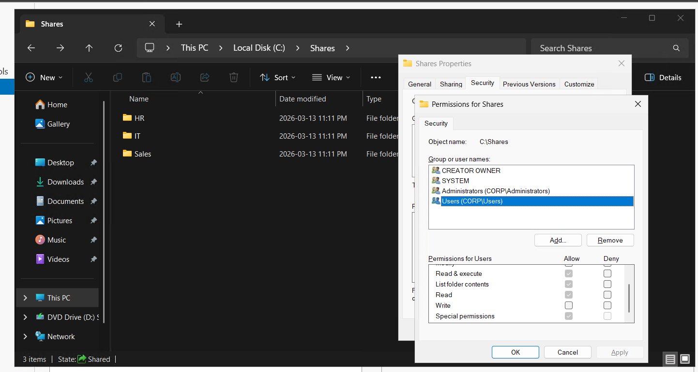

# Hybrid Identity Lab (Active Directory + Microsoft Entra ID)

## 🚀 Project Highlights
- Built a hybrid identity lab integrating on-prem Active Directory with Microsoft Entra ID
- Synchronized users and groups using Microsoft Entra Connect
- Configured Hybrid Microsoft Entra Join for a Windows 11 client
- Implemented file shares with NTFS permissions and Group Policy drive mapping
- Enabled Security Defaults for baseline cloud identity security

---

## 🧭 Overview
This project demonstrates a **hybrid identity architecture** where on-premises Active Directory is integrated with **Microsoft Entra ID (Azure AD)**.
s
It simulates a real-world enterprise environment where identities are:
- Managed on-prem
- Synchronized to the cloud
- Used for both local and cloud authentication

---

## 💼 Why This Project Matters
Many organizations still rely on **Active Directory** while adopting **cloud services like Microsoft 365**.

Hybrid identity allows:
- Centralized identity management
- Seamless authentication across environments
- Secure access to cloud applications

This project demonstrates how those systems work together in practice.

---

## 🏗️ Architecture



---

## 🖥️ Environment

- **DC01** – Active Directory Domain Controller (AD DS, DNS, GPO)
- **SYNC01** – Microsoft Entra Connect Sync Server
- **CLIENT01** – Windows 11 domain-joined workstation
- **Microsoft Entra ID** – Cloud identity provider

---

## ⚙️ What I Built

- Active Directory Domain Services (AD DS)
- Organizational Units and security groups
- Department-based file shares with NTFS permissions
- Group Policy drive mapping
- Microsoft Entra Connect synchronization
- Hybrid Microsoft Entra joined device
- Security Defaults (baseline MFA)

---

## ☁️ Hybrid Identity Flow

```text
User logs in → CLIENT01 → DC01 (authentication)

DC01 → SYNC01 → Microsoft Entra ID (sync users + passwords)

CLIENT01 → Microsoft Entra ID (device registration)
```

---

## ✅ Validation

- Verified users synchronized to Microsoft Entra ID  
- Confirmed **On-premises sync enabled = Yes**  
- Verified CLIENT01 shows as **Hybrid Azure AD Joined**  
- Tested domain login with synced users  
- Verified file share access based on AD security groups  
- Confirmed mapped drives applied via Group Policy  

---

## 📸 Screenshots

### Users (Synced from Active Directory)


### Devices (Hybrid Azure AD Join)


### Active Directory Structure




### File Share Permissions


---

## 🧠 Key Learnings

- Hybrid identity is critical for modern enterprise environments
- DNS configuration is essential for domain join and identity resolution
- Microsoft Entra Connect requires tenant-based admin credentials
- Device registration can be validated using `dsregcmd /status`
- Group Policy and NTFS permissions work together for access control

---

## 🛠️ Troubleshooting

### Issue: Domain join failed
**Cause:** Incorrect DNS configuration  
**Fix:** Set DNS to DC01 and verified connectivity  

### Issue: Device not hybrid joined
**Cause:** Registration not completed  
**Fix:** Ran `gpupdate /force` and `dsregcmd /join`, then verified with `dsregcmd /status`  

### Issue: Entra Connect login failed
**Cause:** Used personal Microsoft account  
**Fix:** Used tenant Global Administrator account  

---

## 📄 Documentation

- [Setup Guide](./SETUP-GUIDE.md)
- [Architecture](./ARCHITECTURE.md)

---

## 💼 Resume Bullet

> Built a hybrid identity lab integrating on-premises Active Directory with Microsoft Entra ID using Entra Connect. Configured user and group synchronization, Hybrid Azure AD Join, Group Policy drive mapping, NTFS-based access control, and baseline identity security using Security Defaults.

---

## 🚀 Future Improvements

- Conditional Access policies (requires P1 license)
- Self-Service Password Reset (SSPR)
- Microsoft Intune device management
- Monitoring and logging (Entra sign-in logs)

---

## 👤 Author

Calvin Wong

https://www.linkedin.com/in/calvinkmwong/